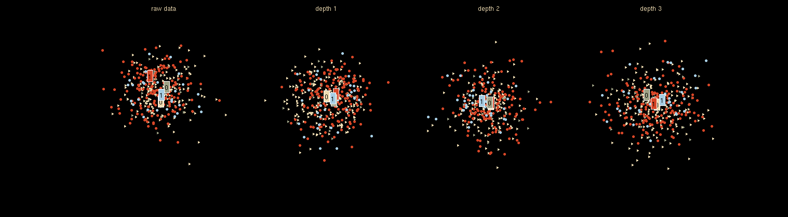

  

# Machine Learning_PI2_Colombian Real-State
   The main goal of this project will be to put into practice the predicting tools and skills learned throughout **Henry's Machine Learning** phase Bootcamp.

  The project starts with two given datasets. The required task will be a single-column .csv file with predicts.

  The datasets provided contain information about Colombian company real-state sales. The requirement is to predict whether a property sale price was economical or     expensive based on the mean of their values.

   The process followed begins with Pre-Processing tasks, visual and numerical analysis, and 'NaN' values dealing to mention. Next, work with categorical features as a way of converting them from categorical to numerical records. Later, implement one of the classified Machine Learning algorithms and apply their training and testing process to finally get predictions.

  In this repository, you will find a "Jupyter" notebook which shows my dealing with Henry's assignment and the process mentioned above.

## Built With

- Python libraries: Numpy, Pandas, Matplotlib, Seaborn, Sklearn, Missingno

- Sklearn algorithm: DecisionTreeClassifier

- Jupyter notebook

- VSCode

## Prerequisites

- Knowledge about pandas python and sklearn machine learning algorithms.

## Authors

👤 **Leon Yohel Espitia**

- GitHub: [@Leon-Espitia](https://github.com/Leon-Espitia)
- Twitter: [@LenEspitia1](https://twitter.com/LenEspitia1)
- LinkedIn: [leon-espitia](https://www.linkedin.com/in/leon-espitia/)

## 🤝 Contributing

Contributions, issues, and feature requests are welcome!

## Show your support

Give a ⭐️ if you like this project!
